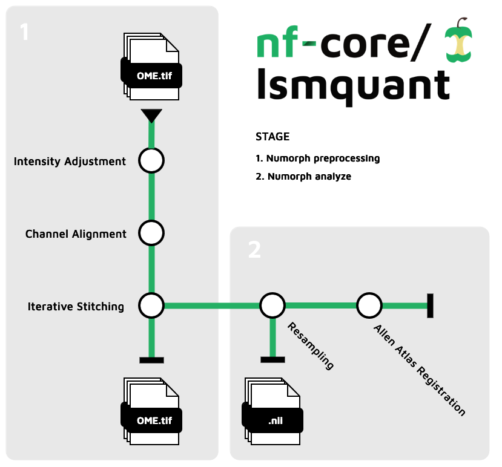

<h1>
  <picture>
    <source media="(prefers-color-scheme: dark)" srcset="docs/images/nf-core-lsmquant_logo_dark.png">
    
  </picture>
</h1>

[](https://github.com/nf-core/lsmquant/actions/workflows/ci.yml)
[](https://github.com/nf-core/lsmquant/actions/workflows/linting.yml)[](https://nf-co.re/lsmquant/results)[](https://doi.org/10.5281/zenodo.XXXXXXX)
[](https://www.nf-test.com)

[](https://www.nextflow.io/)
[](https://docs.conda.io/en/latest/)
[](https://www.docker.com/)
[](https://sylabs.io/docs/)
[](https://cloud.seqera.io/launch?pipeline=https://github.com/nf-core/lsmquant)

[](https://nfcore.slack.com/channels/lsmquant)[](https://twitter.com/nf_core)[](https://mstdn.science/@nf_core)[](https://www.youtube.com/c/nf-core)

## Introduction

**nf-core/lsmquant** is a bioinformatics pipeline that performs preprocessing and analysis of light-sheet microscopy images of tissue cleard samples. The pipeline takes 2D single-channel 16-bit `.tif` images as input. The preprocessing consists of intesity adjustment, channel alignemnt, and tile stitching to reconstruct the 3D image. For mousebrain samples it offers a regsitration to the Allen Mouse Brain Reference Atlas for precise region annotation. Analysis of images can include call quantification via segmentation by a 3D-Unet and celltype classification by SVMs.


<div style="text-align: center;">

</div>


### Basic workflow

1. Intensity Adjustment
2. Channel Alignment
3. Iterative Stitching
4. Resampling (not added)
5. Allen Referece Atlas Registration (not added)

## Pipeline Summary

The pipeline consists of three major stages, the `preprocessing`stage, the `registration`stage, and the `analysis` stage. 

### Preprocessing

For raw 2D single-channel 16-bit `.tif` images produced by a light sheet microscope preprocessing can be performed to recostruct the 3D image in nifti (`.nii`) format for further analysis. The complete `preprocessing` workflow performs: 

- intensity adjustemnt of the images 
- image channel alignemnt for at least two different channels
- image tile stitching to recustruct the full image for each channel and z-slice

### Registration

Currently only available for whole mouse brain samples, recostructed images in `.nii`format can be registerd to the Allen Reference Atlas (ARA) for functional brain region annotation. The workflow performs:
- downsampling of the high resolution `.nii`images
- registration to the ARA

### Analysis 

Analysis will include semantic segmentation of cell nuclei via 3D-Unet

Work in progress..


## Usage

> [!NOTE]
> If you are new to Nextflow and nf-core, please refer to [this page](https://nf-co.re/docs/usage/installation) on how to set-up Nextflow. Make sure to [test your setup](https://nf-co.re/docs/usage/introduction#how-to-run-a-pipeline) with `-profile test` before running the workflow on actual data.


To run the pipeline you need to provide a parameter sheet (.csv file) that needs to have this specific structure: 
Please get the basic tempalte file here ( include maybe link to template csv which can be found in the repo ?)
 `parametersheet.csv`

Please specify which step you want to run with `--stage`. The following are valide options: 

- 'intensity'
- 'align'
- 'stitch'
- 'resample'
- 'register'
- 'process'


Now, you can run the pipeline using:

<!-- TODO nf-core: update the following command to include all required parameters for a minimal example -->

```bash
nextflow run nf-core/lsmquant \
   -profile <docker/singularity/.../institute> \
   --input <path/to/image/folder> \
   --outdir <OUTDIR> \
   --parameter_file <filepath> \
   --sample_name <samplename> \
   --stage <stage> 
```

> [!WARNING]
> Please provide pipeline parameters via the CLI or Nextflow `-params-file` option. Custom config files including those provided by the `-c` Nextflow option can be used to provide any configuration _**except for parameters**_; see [docs](https://nf-co.re/docs/usage/getting_started/configuration#custom-configuration-files).

For more details and further functionality, please refer to the [usage documentation](https://nf-co.re/lsmquant/usage) and the [parameter documentation](https://nf-co.re/lsmquant/parameters).

## Pipeline output

To see the results of an example test run with a full size dataset refer to the [results](https://nf-co.re/lsmquant/results) tab on the nf-core website pipeline page.
For more details about the output files and reports, please refer to the
[output documentation](https://nf-co.re/lsmquant/output).

## Credits

nf-core/lsmquant was originally written by Carolin Schwitalla.

The pipeline is mainly based on the NuMorph (Nuclear-Based Morphometry) toolbox developed by Krupa et al., 2021.

>**NuMorph: Tools for cortical cellular phenotyping in tissue-cleared whole-brain images**
>
>Krupa O, Fragola G, Hadden-Ford E, Mory JT, Liu T, Humphrey Z, Rees BW, Krishnamurthy A, Snider WD, Zylka MJ, Wu G, Xing L, Stein JL.
>
>Cell Rep. 2021 Oct 12, doi: [10.1016/j.celrep.2021.109802](https://doi.org/10.1016%2Fj.celrep.2021.109802)


We thank the following people for their extensive assistance in the development of this pipeline:

<!-- TODO nf-core: If applicable, make list of people who have also contributed -->

## Contributions and Support

If you would like to contribute to this pipeline, please see the [contributing guidelines](.github/CONTRIBUTING.md).

For further information or help, don't hesitate to get in touch on the [Slack `#lsmquant` channel](https://nfcore.slack.com/channels/lsmquant) (you can join with [this invite](https://nf-co.re/join/slack)).

## Citations

<!-- TODO nf-core: Add citation for pipeline after first release. Uncomment lines below and update Zenodo doi and badge at the top of this file. -->
<!-- If you use nf-core/lsmquant for your analysis, please cite it using the following doi: [10.5281/zenodo.XXXXXX](https://doi.org/10.5281/zenodo.XXXXXX) -->

<!-- TODO nf-core: Add bibliography of tools and data used in your pipeline -->

An extensive list of references for the tools used by the pipeline can be found in the [`CITATIONS.md`](CITATIONS.md) file.

You can cite the `nf-core` publication as follows:

> **The nf-core framework for community-curated bioinformatics pipelines.**
>
> Philip Ewels, Alexander Peltzer, Sven Fillinger, Harshil Patel, Johannes Alneberg, Andreas Wilm, Maxime Ulysse Garcia, Paolo Di Tommaso & Sven Nahnsen.
>
> _Nat Biotechnol._ 2020 Feb 13. doi: [10.1038/s41587-020-0439-x](https://dx.doi.org/10.1038/s41587-020-0439-x).
