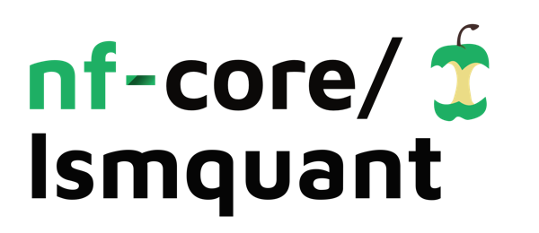
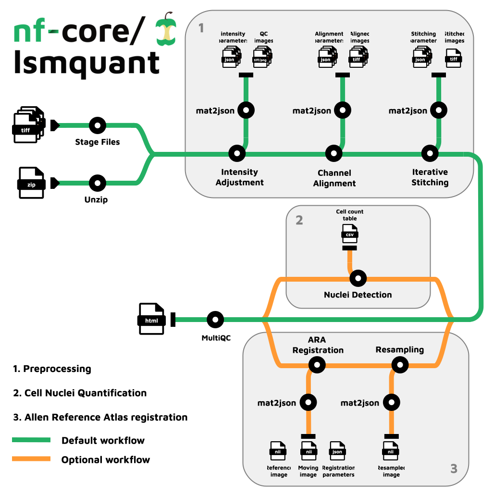

<h1>
  <picture>
    <source media="(prefers-color-scheme: dark)" srcset="docs/images/nf-core-lsmquant_logo_dark.png">
    
  </picture>
</h1>

[](https://github.com/nf-core/lsmquant/actions/workflows/nf-test.yml)
[](https://github.com/nf-core/lsmquant/actions/workflows/linting.yml)[](https://nf-co.re/lsmquant/results)[](https://doi.org/10.5281/zenodo.XXXXXXX)
[](https://www.nf-test.com)

[](https://www.nextflow.io/)
[](https://github.com/nf-core/tools/releases/tag/3.3.2)
[](https://docs.conda.io/en/latest/)
[](https://www.docker.com/)
[](https://sylabs.io/docs/)
[](https://cloud.seqera.io/launch?pipeline=https://github.com/nf-core/lsmquant)

[](https://nfcore.slack.com/channels/lsmquant)[](https://bsky.app/profile/nf-co.re)[](https://mstdn.science/@nf_core)[](https://www.youtube.com/c/nf-core)


## Introduction

**nf-core/lsmquant** is a bioinformatics pipeline that performs preprocessing and analysis of light-sheet microscopy images of tissue cleared samples. The pipeline takes 2D single-channel 16-bit `.tif` images as input. The preprocessing consists of intesity adjustment, channel alignment, and tile stitching to reconstruct the 3D image. For mousebrain samples it offers a registration to the Allen Mouse Brain Reference Atlas for precise region annotation. Cell nuclei quantification is perfomed on the nuclear channel by a 3D-Unet.

<div style="text-align: center;">

</div>

## Basic workflow

**Preprocessing**

1. Intensity Adjustment
2. Channel Alignment
3. Iterative Stitching

**ARA Registration**

4. ARA Registration subworkflow (optional)
5. Cell Nuclei Quantification

**Full**

1. Preprocessing
2. Nuclei quantification

## Pipeline Summary

The pipeline consists of two major workflows `preprocessing` and the `full` workflow. The `ara-regsitration` is an optional subworkflow that works only for whole mouse brain samples.

### Preprocessing

Preprocessing is performed on raw 2D single-channel 16-bit `.tif` images produced by a light sheet microscope. Three individual steps are performed:

- **Intensity adjustments** to correct for the Gaussian shape of the lightsheet and intensity differences between adjacent tiles
- **Image channel alignment** using a 2D rigid approach or a nonlinear 3D approach using Elastix.
- **Image tile stitching** via an iterative 2D stitching approach by calculating z displacements and xy translations using phase correlation and SIFT.

### Full

Quantification of cell-nuclei is performed using a 3D-Unet. It is performed on the nuclear channel only, assuming that the corresponding image file names contain the pattern `C1`.

### ARA Registration

Optional registration to the Allen Reference Atlas (ARA) for functional brain region annotation can be perfomed before segmentation.
This includes the following two steps:

- Downsampling of the high resolution stitched images
- Registration to the ARA

## Usage

> [!NOTE]
> If you are new to Nextflow and nf-core, please refer to [this page](https://nf-co.re/docs/usage/installation) on how to set-up Nextflow. Make sure to [test your setup](https://nf-co.re/docs/usage/introduction#how-to-run-a-pipeline) with `-profile test` before running the workflow on actual data.

To run the pipeline you need to provide a samplesheet with your data in the following structure:

`samplesheet.csv`

```csv
sample_id,img_directory,parameter_file
TEST1,path/to/image-files,path/to/parameter/file.csv
```

The parameter csv file includes sample specific parameters that are used for processing the given data. It needs to follow a specific structure.

Please get the basic template file [here](../assets/params_template_lsmquant.csv).
`parametersheet.csv`

Now, you can run the pipeline using:

<!-- TODO nf-core: update the following command to include all required parameters for a minimal example -->

```bash
nextflow run nf-core/lsmquant \
   -profile <docker/singularity/.../institute> \
   --input <samplesheet.csv> \
   --outdir <OUTDIR> \
   --stage <stage>
```

> [!WARNING]
> Please provide pipeline parameters via the CLI or Nextflow `-params-file` option. Custom config files including those provided by the `-c` Nextflow option can be used to provide any configuration _**except for parameters**_; see [docs](https://nf-co.re/docs/usage/getting_started/configuration#custom-configuration-files).

For more details and further functionality, please refer to the [usage documentation](https://nf-co.re/lsmquant/usage) and the [parameter documentation](https://nf-co.re/lsmquant/parameters).

## Pipeline output

To see the results of an example test run with a full size dataset refer to the [results](https://nf-co.re/lsmquant/results) tab on the nf-core website pipeline page.
For more details about the output files and reports, please refer to the
[output documentation](https://nf-co.re/lsmquant/output).

## Credits

nf-core/lsmquant was originally written by [Carolin Schwitalla](https://github.com/CaroAMN) at the Quantitative Biology Center Tuebingen ([QBiC](https://www.info.qbic.uni-tuebingen.de/)).

The pipeline is mainly based on the NuMorph (Nuclear-Based Morphometry) toolbox developed by Krupa et al., 2021.

> **NuMorph: Tools for cortical cellular phenotyping in tissue-cleared whole-brain images**
>
> Krupa O, Fragola G, Hadden-Ford E, Mory JT, Liu T, Humphrey Z, Rees BW, Krishnamurthy A, Snider WD, Zylka MJ, Wu G, Xing L, Stein JL.
>
> Cell Rep. 2021 Oct 12, doi: [10.1016/j.celrep.2021.109802](https://doi.org/10.1016%2Fj.celrep.2021.109802)

We thank the following people for their extensive assistance in the development of this pipeline:

[Matthias Hörtenhuber](https://github.com/mashehu)\
[Famke Bäuerle](https://github.com/famosab)\
[Mark Polster](https://github.com/mapo9)\
[Susi Jo](https://github.com/SusiJo)\
[Luis Kuhn Cuellar](https://github.com/luiskuhn)\
[Daniel Straub](https://github.com/d4straub)
[Tatiana Woller](https://github.com/tatianawoller)\
[Niklas Grote](https://github.com/HomoPolyethylen)\
Jason Stein\
Felix Kyere\
Ian Curtin

## Contributions and Support

If you would like to contribute to this pipeline, please see the [contributing guidelines](.github/CONTRIBUTING.md).

For further information or help, don't hesitate to get in touch on the [Slack `#lsmquant` channel](https://nfcore.slack.com/channels/lsmquant) (you can join with [this invite](https://nf-co.re/join/slack)).

## Citations

<!-- TODO nf-core: Add citation for pipeline after first release. Uncomment lines below and update Zenodo doi and badge at the top of this file. -->
<!-- If you use nf-core/lsmquant for your analysis, please cite it using the following doi: [10.5281/zenodo.XXXXXX](https://doi.org/10.5281/zenodo.XXXXXX) -->

<!-- TODO nf-core: Add bibliography of tools and data used in your pipeline -->

An extensive list of references for the tools used by the pipeline can be found in the [`CITATIONS.md`](CITATIONS.md) file.

You can cite the `nf-core` publication as follows:

> **The nf-core framework for community-curated bioinformatics pipelines.**
>
> Philip Ewels, Alexander Peltzer, Sven Fillinger, Harshil Patel, Johannes Alneberg, Andreas Wilm, Maxime Ulysse Garcia, Paolo Di Tommaso & Sven Nahnsen.
>
> _Nat Biotechnol._ 2020 Feb 13. doi: [10.1038/s41587-020-0439-x](https://dx.doi.org/10.1038/s41587-020-0439-x).
